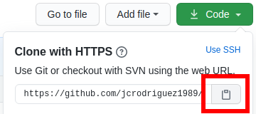
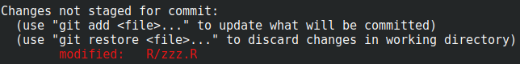
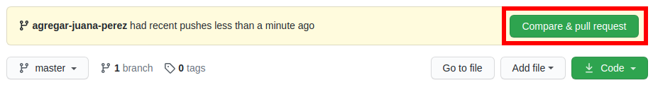

```{r, include = FALSE}
knitr::opts_chunk$set(collapse = TRUE, comment = "#>", out.width = "100%")
library("firstContributionsInR")
```

# Primeras Contribuciones en R

<!-- badges: start -->

[](https://github.com/jcrodriguez1989/firstContributionsInR/actions)
<!-- badges: end -->

Mini tutorial que nos enseña a contribuir al código libre en R. Este tutorial se basa en el trabajo 
del repositorio [First Contributions
](https://github.com/firstcontributions/first-contributions/blob/master/translations/README.es.md).

## Contribuyentes actuales!

A este repositorio han podido contribuido `r nrow(obtener_contribuyentes())` personas.
Tomando una muestra de 500, veamos la distribución del país de los contribuyentes:

```{r muestreo}
library("firstContributionsInR")
library("ggplot2")

ggplot(muestra_contribuyentes(n = 500), aes(x = Pais)) +
  geom_bar()
```

## Instalación del paquete R

Actualmente, `firstContributionsInR` se encuentra unicamente como un paquete de
GitHub.

Para instalarlo, correr el siguiente código en una consola R:

```{r eval = FALSE}
if (!require("remotes")) {
  install.packages("remotes")
}
remotes::install_github("jcrodriguez1989/firstContributionsInR")
```

## Tu primer contribución!

Si no lo has hecho aún, [inicia seción en GitHub](https://github.com/login). Si no tienes una cuenta, [crea una](https://github.com/join), es gratis!

Si no tienes git en tu equipo, puedes encontrar instrucciones para instalarlo en [este enlace](https://help.github.com/articles/set-up-git/).

### Bifurca (*Fork*) este repositorio

Haz un *fork* de este repositorio haciendo click en el botón "*Fork*" en la parte superior derecha en esta página.
Esto creará una copia de este repositorio en tu cuenta de GitHub.

### Clona (*Clone*) el repositorio


Ahora clona este repositorio en tu equipo. Dirígete a tu cuenta de GitHub, haz click en el botón "*clone or download*" y luego haz click en el icono para *copiar al portapapeles*.

Abre tu consola o terminal y ejecuta el siguiente comando de git:

```
git clone "url que acabas de copiar"
```

Donde pone "url que acabas de copiar" (sin las comillas dobles) es la *url* a este repositorio (tu *fork* a este proyecto). Mira los pasos previos para obtener la *url*.



Por ejemplo:
```
git clone https://github.com/este-eres-tu/firstContributionsInR.git
```
La parte de `este-eres-tu` la reemplazarás con tu usuario de GitHub. Aquí estás copiando los contenidos del repositorio *firstContributionsInR* en GitHub a tu equipo.

### Crea una rama (*Branch*)

Cambia al directorio del repositorio en tu equipo (si es que no estás ahí ya).

```
cd firstContributionsInR
```

Ahora crea una rama (*branch*) usando el comando  `git checkout`:
```
git checkout -b <añade tu nombre>
```

Por ejemplo:
```
git checkout -b agregar-juana-perez
```
(El nombre de la rama no tiene por qué contener la palabra *add*, pero es razonable que lo tenga porque el objetivo de esta rama es añadir tu nombre a la lista.)

### Haz los cambios necesarios y confirma (*Commit*) esos cambios

Abre el archivo `R/zzz.R` en un editor de texto y añade tu nombre y bandera. Guarda el archivo.



Si vas al directorio del proyecto y ejecutas el comando  `git status`, verás que hay cambios.

Agrega esos cambios a la rama (*branch*) que creaste anteriormente usando el comando `git add`:

```
git add R/zzz.R
```

Ahora haz un *commit* sobre estos cambios ejecutando el comando `git commit`:
```
git commit -m "Agregando a <tu-nombre> como contribuyente"
```
cambiando `<tu-nombre>` con tu nombre.

### Manda (*Push*) tus cambios a GitHub

Haz *push* de tus cambios usando el comando `git push`:
```
git push origin <añade-el-nombre-de-la-rama>
```
Reemplaza `<añade-el-nombre-de-la-rama>` con el nombre de la rama que creaste anteriormente. En este ejemplo, sería:
```
git push origin agregar-juana-perez
```

### Envía (*Submit*) tus cambios para ser revisados

Si vas a tu repositorio en GitHub, verás un botón `Compare & pull request`. Haz click sobre este botón.



Ahora envía la *pull request*.


Pronto estaré fusionando tus cambios (haciendo *merge*) con la rama master de este proyecto. Recibirás una notificación por correo electrónico cuando los cambios hayan sido fusionados.

### ¿Cuáles son los siguientes pasos?

¡Enhorabuena! ¡Has completado el flujo de trabajo *_fork -> clone -> edit -> PR_* que encontrarás habitualmente como contribuidor!

Si quieres ser perfeccionar tus habilidades con git, te recomiendo el material [Happy Git and GitHub for the useR
](https://happygitwithr.com/).
