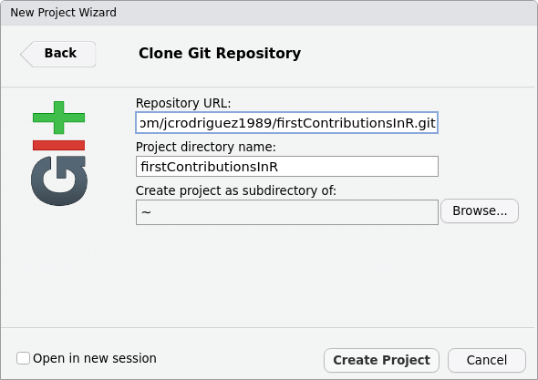
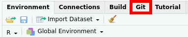
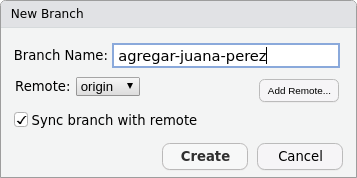
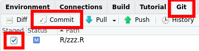
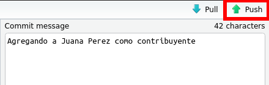

```{r, include = FALSE}
knitr::opts_chunk$set(collapse = TRUE, comment = "#>", out.width = "100%")
library("firstContributionsInR")
```

# Primeras Contribuciones en R

<!-- badges: start -->
[](https://github.com/ellerbrock/open-source-badges/)
[](https://github.com/jcrodriguez1989/firstContributionsInR/actions)
<!-- badges: end -->

Mini tutorial que nos enseña a contribuir al código libre en R. Este tutorial se basa en el trabajo 
del repositorio [First Contributions
](https://github.com/firstcontributions/first-contributions/blob/master/translations/README.es.md).

## ¡Contribuyentes actuales!

A este repositorio han contribuido `r nrow(obtener_contribuyentes())` personas.
Tomando una muestra de 500, veamos la distribución del país de los contribuyentes:

```{r muestreo}
library("firstContributionsInR")
library("dplyr")
library("ggplot2")

muestra_contribuyentes(n = 500) %>% 
  count(Pais) %>% 
  ggplot(aes(x = Pais, y = n, label = Pais)) +
  geom_col() +
  geom_text(aes(y = n / 2)) +
  theme(axis.text.x = element_blank())
```

## Instalación del paquete R

Actualmente, `firstContributionsInR` se encuentra únicamente como un paquete de
GitHub.

Para instalarlo, correr el siguiente código en una consola R:

```{r eval = FALSE}
if (!require("remotes")) {
  install.packages("remotes")
}
remotes::install_github("jcrodriguez1989/firstContributionsInR")
```

## ¡Tu primera contribución!

Si no lo has hecho aún, [inicia sesión en GitHub](https://github.com/login). Si no tienes una cuenta, [créala](https://github.com/join), ¡es gratis!

Si no tienes git en tu equipo, puedes encontrar instrucciones para instalarlo en [este enlace](https://help.github.com/articles/set-up-git/). Igualmente, RStudio incluye una interfaz a git `r emojifont::emoji("wink")`.

### Bifurca (*Fork*) este repositorio

Haz un *fork* de este repositorio haciendo click en el botón "*Fork*" en la parte superior derecha en esta página.
Esto creará una copia de este repositorio en tu cuenta de GitHub.

### Clona (*Clone*) el repositorio


Ahora clona este repositorio en tu equipo. Haz click en el botón "*Code*" y luego haz click en el icono para *copiar al portapapeles*.

Abre RStudio, haz click en *File* ~> *New Project...* ~> *Version Control* ~> *Git*, pega la "url que acabas de copiar" en el campo de *Repository URL:* y dale click a *Create Project*.


```{r, echo=FALSE}

```

### Crea una rama (*Branch*)



En RStudio, localiza la pestaña *Git*, hazle click. Da click en el botón *New Branch*. Dale un nombre a la nueva rama, por ejemplo, "agregar-juana-perez".



### Haz los cambios necesarios y confirma (*Commit*) esos cambios

Abre el archivo `R/zzz.R`, añade tu nombre y bandera. Guarda el archivo.

Agrega los cambios realizados (archivo `R/zzz.R`) tildándolos y dando click en *Commit*.


Agrega un mensaje al *Commit* (por ejemplo, "Agregando a `<tu-nombre>` como contribuyente"), y vuelve a clickear en *Commit*. Se abrirá una ventana que muestra los cambios realizados, ciérrala dando click en *Close*.



### Manda (*Push*) tus cambios a GitHub

Haz *push* de tus cambios. Para hacer esto, solo basta con dar click en el botón *Push*.



### Envía (*Submit*) tus cambios para ser revisados

Si vas a tu repositorio en GitHub, verás un botón `Compare & pull request`. Haz click sobre este botón.


Ahora envía la *pull request*.


Pronto quien mantiene el repositorio (en este ejemplo yo!) estará fusionando tus cambios (haciendo *merge*) con la rama master de este proyecto. Recibirás una notificación por correo electrónico cuando los cambios hayan sido fusionados.

### ¿Cuáles son los siguientes pasos?

¡Enhorabuena! ¡Has completado el flujo de trabajo *_fork ~> clone ~> edit ~> PR_* que encontrarás habitualmente como contribuidor!

Si quieres perfeccionar tus habilidades con git, te recomiendo el material [Happy Git and GitHub for the useR
](https://happygitwithr.com/).

### ¿En qué puedo contribuir?

¡Fácil! Dirígete al repositorio de GitHub de tu paquete R favorito, por ejemplo [el de `ggplot2`](https://github.com/tidyverse/ggplot2). Haz click en el botón [*Issues*](https://github.com/tidyverse/ggplot2/issues). ¡Asígnate uno de los cientos de issues que debe haber sin resolver!

```{r echo = FALSE, results = "asis", eval = tolower(months(Sys.Date())) %in% c("septiembre", "october")}
cat("
### Hacktoberfest

¡Oye! Estamos en Octubre, época en la que [Hacktoberfest](https://hacktoberfest.digitalocean.com/) nos premia por contribuir al código libre!
Inscríbete al Hacktoberfest, y durante todo Octubre, si realizas 4 Pull Requests a repositorios adheridos, recibirás un premio por ello!

¿Qué repositorios participan en Hacktoberfest? En el [siguiente enlace](https://github.com/search?l=R&q=label%3Ahacktoberfest+state%3Aopen+no%3Aassignee+is%3Aissue&type=Issues) encontrarás repositorios R para los cuales sus creadores han marcado issues fácilmente solucionables durante el Hacktoberfest.
Además, también valen PR, no asociadas a issues, para cualquiera de los repositorios R de [esta lista](https://github.com/topics/hacktoberfest?l=R).
También valen PR a otros repositorios públicos siempre que el PR sea etiquetado como _hacktoberfest-accepted_ por quien mantiene el repositorio.

")
```

