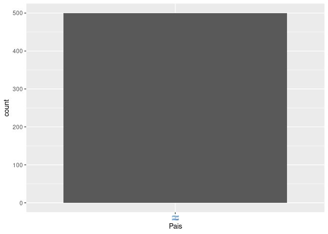

# Primeras Contribuciones en R

<!-- badges: start -->

[](https://github.com/jcrodriguez1989/firstContributionsInR/actions)
<!-- badges: end -->

Mini tutorial que nos enseña a contribuir al código libre en R. Este
tutorial se basa en el trabajo del repositorio [First
Contributions](https://github.com/firstcontributions/first-contributions/blob/master/translations/README.es.md).

## Contribuyentes actuales\!

A este repositorio han podido contribuido 1 personas. Tomando una
muestra de 500, veamos la distribución del pais de cada contribuyente:

``` r
library("firstContributionsInR")
library("ggplot2")

ggplot(muestra_contribuyentes(n = 500), aes(x = Pais)) +
  geom_bar()
```



## Instalación del paquete R

Actualmente, `firstContributionsInR` se encuentra unicamente como un
paquete de GitHub.

Para instalarlo, correr lo siguiente en una consola R:

``` r
if (!require("remotes")) {
  install.packages("remotes")
}
remotes::install_github("jcrodriguez1989/firstContributionsInR")
```
